<!--
  Profile README for github.com/ramzanBilal
  Replace every YOUR_* placeholder. See LAUNCH-GUIDE.md §0 for the full list.
-->

<h1 align="center">Bilal Ramzan · Senior Mobile App Developer</h1>

  <strong style="font-size:1.1em">Senior React Native | Expo | Flutter | SwiftUI developer</strong>
   
  8 years · successfully deployed apps on the App Store and Google Play

## Tech stack

<picture><source media="(prefers-color-scheme: dark)" srcset="https://cdn.simpleicons.org/ionic/ffffff"></picture>

<picture><source media="(prefers-color-scheme: dark)" srcset="https://cdn.simpleicons.org/github/ffffff"></picture>

<picture><source media="(prefers-color-scheme: dark)" srcset="https://cdn.simpleicons.org/swagger/ffffff"></picture>
<picture><source media="(prefers-color-scheme: dark)" srcset="https://cdn.simpleicons.org/xcode/ffffff"></picture>

<picture><source media="(prefers-color-scheme: dark)" srcset="https://cdn.simpleicons.org/stripe/ffffff"></picture>
<picture><source media="(prefers-color-scheme: dark)" srcset="https://cdn.simpleicons.org/paypal/ffffff"></picture>
<picture><source media="(prefers-color-scheme: dark)" srcset="https://cdn.simpleicons.org/googlepay/ffffff"></picture>
<picture><source media="(prefers-color-scheme: dark)" srcset="https://cdn.simpleicons.org/applepay/ffffff"></picture>
<picture><source media="(prefers-color-scheme: dark)" srcset="https://cdn.simpleicons.org/google/ffffff"></picture>
<picture><source media="(prefers-color-scheme: dark)" srcset="https://cdn.simpleicons.org/apple/ffffff"></picture>
<picture><source media="(prefers-color-scheme: dark)" srcset="https://cdn.simpleicons.org/facebook/ffffff"></picture>

**Also working with**

## Connect with me

  <a href="https://www.linkedin.com/in/ramzanbilal/" title="LinkedIn" target="_blank" rel="noopener noreferrer"><picture><source media="(prefers-color-scheme: dark)" srcset="https://raw.githubusercontent.com/ramzanbilal/ramzanbilal/main/assets/icons/linkedin-white.svg"></picture></a>&nbsp;&nbsp;
  <a href="https://www.instagram.com/mobileapparchitect" title="Instagram" target="_blank" rel="noopener noreferrer"><picture><source media="(prefers-color-scheme: dark)" srcset="https://cdn.simpleicons.org/instagram/ffffff"></picture></a>&nbsp;&nbsp;
  <a href="https://bilal.devhustles.com" title="Portfolio" target="_blank" rel="noopener noreferrer"><picture><source media="(prefers-color-scheme: dark)" srcset="https://raw.githubusercontent.com/ramzanbilal/ramzanbilal/main/assets/icons/globe-white.svg"></picture></a>&nbsp;&nbsp;
  <a href="https://www.upwork.com/freelancers/bilalramzan6?viewMode=1" title="Upwork" target="_blank" rel="noopener noreferrer"><picture><source media="(prefers-color-scheme: dark)" srcset="https://cdn.simpleicons.org/upwork/ffffff"></picture></a>&nbsp;&nbsp;
  <a href="https://www.fiverr.com/users/bilalramzan14/" title="Fiverr" target="_blank" rel="noopener noreferrer"><picture><source media="(prefers-color-scheme: dark)" srcset="https://cdn.simpleicons.org/fiverr/ffffff"></picture></a>

## GitHub activity

  

<!-- Optional snake. See LAUNCH-GUIDE.md §3.6

  

-->

## Publications

  <a href="https://medium.com/@ramzanbilal14" title="Medium" target="_blank" rel="noopener noreferrer"><picture><source media="(prefers-color-scheme: dark)" srcset="https://cdn.simpleicons.org/medium/ffffff"></picture></a>&nbsp;&nbsp;&nbsp;&nbsp;&nbsp;
  <a href="https://stackoverflow.com/users/7912296/bilal-ramzan" title="Stack Overflow" target="_blank" rel="noopener noreferrer"><picture><source media="(prefers-color-scheme: dark)" srcset="https://cdn.simpleicons.org/stackoverflow/ffffff"></picture></a>

## Resume

  

## Portfolio: shipped mobile apps

Most client work ships under someone else's name and stays private. These are the ones I can point at.

<table>
<tr>
<td width="50%" valign="top" align="left">

&nbsp;&nbsp;<strong style="font-size:1.4em; vertical-align:middle">Cleansai</strong>

AI-powered duplicate detection and storage cleanup, entirely on-device.

<a href="https://play.google.com/store/apps/details?id=com.digitarchs.cleansai" target="_blank" rel="noopener noreferrer"><picture><source media="(prefers-color-scheme: dark)" srcset="https://cdn.simpleicons.org/googleplay/ffffff"></picture></a>&nbsp;&nbsp;&nbsp;<a href="https://cleansai.digitarchs.com/" target="_blank" rel="noopener noreferrer"><picture><source media="(prefers-color-scheme: dark)" srcset="https://raw.githubusercontent.com/ramzanbilal/ramzanbilal/main/assets/icons/globe-white.svg"></picture></a>

</td>
<td width="50%" valign="top" align="left">

&nbsp;&nbsp;<strong style="font-size:1.4em; vertical-align:middle">Broski: AI Wingman</strong>

AI-powered conversation coach. Never get left on read again.

<a href="https://apps.apple.com/us/app/broski-ai-wingman/id6754784915" target="_blank" rel="noopener noreferrer"><picture><source media="(prefers-color-scheme: dark)" srcset="https://cdn.simpleicons.org/apple/ffffff"></picture></a>&nbsp;&nbsp;&nbsp;<a href="https://play.google.com/store/apps/details?id=com.broski.app" target="_blank" rel="noopener noreferrer"><picture><source media="(prefers-color-scheme: dark)" srcset="https://cdn.simpleicons.org/googleplay/ffffff"></picture></a>

</td>
</tr>
<tr>
<td width="50%" valign="top" align="left">

&nbsp;&nbsp;<strong style="font-size:1.4em; vertical-align:middle">A+ Payroll</strong>

Payroll management app for small businesses.

<a href="https://apps.apple.com/kw/app/a-payroll/id1533811526" target="_blank" rel="noopener noreferrer"><picture><source media="(prefers-color-scheme: dark)" srcset="https://cdn.simpleicons.org/apple/ffffff"></picture></a>

</td>
<td width="50%" valign="top" align="left">

&nbsp;&nbsp;<strong style="font-size:1.4em; vertical-align:middle">VExpo</strong>

Host all kinds of events and tradeshows from the palm of your hands.

<a href="https://apps.apple.com/us/app/vexpo/id6480527833" target="_blank" rel="noopener noreferrer"><picture><source media="(prefers-color-scheme: dark)" srcset="https://cdn.simpleicons.org/apple/ffffff"></picture></a>&nbsp;&nbsp;&nbsp;<a href="https://play.google.com/store/apps/details?id=com.app.vexpo" target="_blank" rel="noopener noreferrer"><picture><source media="(prefers-color-scheme: dark)" srcset="https://cdn.simpleicons.org/googleplay/ffffff"></picture></a>

</td>
</tr>
<tr>
<td width="50%" valign="top" align="left">

&nbsp;&nbsp;<strong style="font-size:1.4em; vertical-align:middle">MyHayd</strong>

Islamic period tracking health app, personalized to Muslim women.

<a href="https://apps.apple.com/us/app/myhayd-app/id6739942459" target="_blank" rel="noopener noreferrer"><picture><source media="(prefers-color-scheme: dark)" srcset="https://cdn.simpleicons.org/apple/ffffff"></picture></a>&nbsp;&nbsp;&nbsp;<a href="https://play.google.com/store/apps/details?id=com.myhaydapp" target="_blank" rel="noopener noreferrer"><picture><source media="(prefers-color-scheme: dark)" srcset="https://cdn.simpleicons.org/googleplay/ffffff"></picture></a>

</td>
<td width="50%" valign="top" align="left">

&nbsp;&nbsp;<strong style="font-size:1.4em; vertical-align:middle">Expert Online Training</strong>

Expert-led staff training with videos, tracking, and multilingual support.

<a href="https://apps.apple.com/us/app/expert-online-training-app/id1559523276" target="_blank" rel="noopener noreferrer"><picture><source media="(prefers-color-scheme: dark)" srcset="https://cdn.simpleicons.org/apple/ffffff"></picture></a>&nbsp;&nbsp;&nbsp;<a href="https://play.google.com/store/apps/details?id=com.expertonlinetraining.app" target="_blank" rel="noopener noreferrer"><picture><source media="(prefers-color-scheme: dark)" srcset="https://cdn.simpleicons.org/googleplay/ffffff"></picture></a>

</td>
</tr>
</table>

## What I do

<strong>1. Web to mobile: turning a web product into a real iOS and Android app</strong>

 

Not a WebView wrapper. A native or cross-platform app that shares your backend and your domain logic, and behaves like it belongs on the phone.

What that actually involves: auditing the existing API for what mobile needs (pagination, payload size, auth refresh, offline tolerance), deciding what's shared and what's rebuilt, mapping web routes to a navigation graph instead of copying them, replacing web session handling with secure token storage, adding the things web never needed (push notifications, deep links, background sync, biometric auth, in-app purchases), and getting it through store review.

The part most teams underestimate is state. A web app can afford to refetch on every route change. A mobile app on a bad connection can't, so the caching and offline layer usually gets designed before anything is drawn.

<strong>2. Fixing and optimising AI-generated and vibe-coded apps</strong>

 

A growing share of my work is codebases that were generated fast and then stopped being changeable. The symptoms are consistent: it runs, but nobody can safely add a feature.

How I approach it. Audit first, in writing, before touching anything:

- **Where's the state?** Usually everywhere. Props drilled eight levels, three sources of truth for the same user object, `useEffect` chains that fire in an order nobody can predict.
- **What's the type situation?** `any` at every boundary, or TypeScript that compiles because the errors were silenced.
- **What breaks at scale?** Lists without virtualisation, images without caching, re-renders on every keystroke, a 40MB bundle because every icon set got imported.
- **What's actually dangerous?** API keys in the client, Firebase rules left open, Supabase tables with no RLS, tokens in AsyncStorage instead of secure storage.
- **What can't be verified?** No tests, no CI, no error reporting, so nobody knows whether a fix worked.

Then a staged plan: stop the bleeding (security, crashes), put a safety net under it (types, tests, CI, Sentry), then refactor the parts that block feature work. I don't rewrite from scratch unless the audit says a rewrite is genuinely cheaper, and I say so in writing either way.

<strong>3. App Store and Google Play rejections: getting rejected apps approved</strong>

 

Rejections are usually one of a small set of causes, and most of them are fixable in days, not weeks.

- **Guideline 4.2, minimum functionality**: the "it's just a website" rejection. Needs real native capability, not more screens.
- **Guideline 3.1.1, in-app purchase**: external payment links, or a subscription that doesn't route through StoreKit / Play Billing.
- **Guideline 5.1.1, data and privacy**: permission prompts without purpose strings, account creation demanded before any value, no account _deletion_ path.
- **Privacy manifests and required-reason APIs**: missing `PrivacyInfo.xcprivacy`, or third-party SDKs without their own.
- **Play policy**: Data Safety form that doesn't match actual behaviour, foreground service types, target SDK deadlines, restricted permissions.
- **Guideline 2.1, incomplete information**: demo account missing or broken, reviewer can't reach the feature.

The work is: read the actual rejection text and the referenced guideline, reproduce what the reviewer saw, fix the cause rather than the symptom, then write a reply in Resolution Center that tells them precisely what changed and where to find it. Most of the value is in that last part. A clear reply resolves more rejections than another build does.

